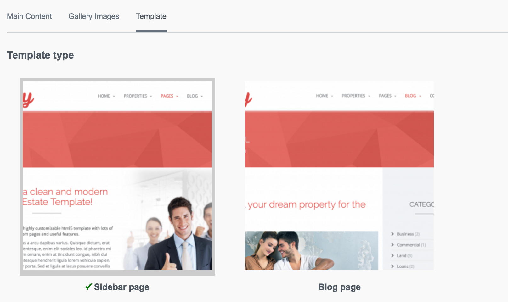

# Image OptionsetField

Provides a list of selectable items that use images as the primary label instead of text.

## Screenshot




## Installation
`composer require unclecheese/silverstripe-image-optionset`

## Configuration

You can configure the default width and height of the images.
```yaml
ImageOptionsetField:
  default_image_width: 300
  default_image_height: 300
```

## Usage
Simple example:
```php
$field = ImageOptionsetField::create('Template', 'Select a template')
                ->setSource([
                    'sidebar' => [
                        'title' => 'Sidebar page',
                        'image' => '/path/to/sidebar.png'
                    ],
                    'block' => [
                        'title' => 'Block page',
                        'image' => '/path/to/block.png'
                    ]
                ]);

// Use a custom image width and height
$field->setImageWidth(100);
$field->setImageHeight(100);

```

If you're not using titles, you can use image paths as the values rather than nested arrays.

```php
$field = ImageOptionsetField::create('Template', 'Select a template')
                ->setSource([
                    'sidebar' => '/path/to/sidebar.png'
                    'block' => '/path/to/block.png'
                ]);

```

## Tests
`tests/ImageOptionsetFieldTest`

## Troubleshooting

Ring Uncle Cheese.